# 🖼️ Node-Based Image Processor

A lightweight image processing application using **Dear ImGui** and **OpenCV**, designed to simulate a node-based interface for editing images. This implementation simplifies the structure into checkbox-driven feature selection, retaining modularity and ease of use.

> 📌 **Note**: This version does not include a graphical node connection system but provides equivalent functionality via toggled checkboxes and sliders.

---

## 🧰 Technologies Used

- **C++**
- **OpenCV** for image processing
- **Dear ImGui** for the graphical user interface
- **CMake** for build management

---

## 📸 Screenshot

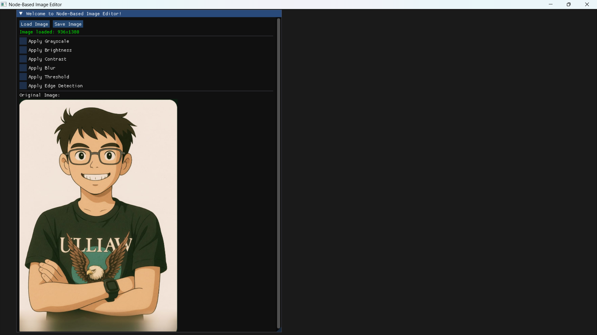

_A modern, real-time image editing interface with live preview._

---

## 🧠 Features Implemented

### 1. Load and Save Image

- Easily load any `.png`, `.jpg`, `.bmp`, etc. format image.
- Save processed image to local storage.

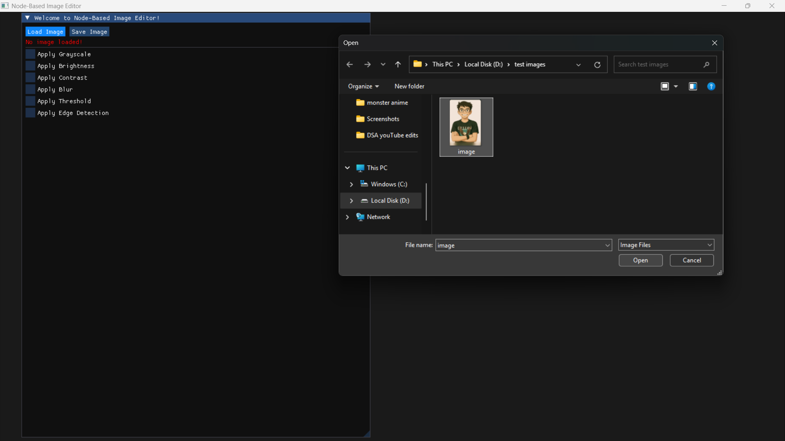

---

### 2. Apply Grayscale

Converts the image to grayscale.

✅ Enabled by checkbox.

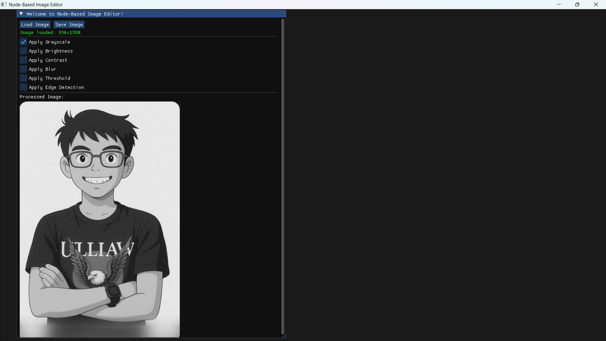

---

### 3. Apply Brightness

Adjust image brightness using a slider. Internally modifies pixel intensity values.

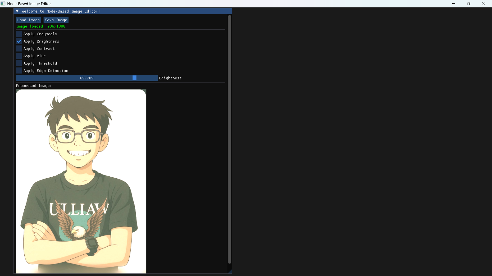

---

### 4. Apply Contrast

Enhances or reduces contrast based on linear transformations.

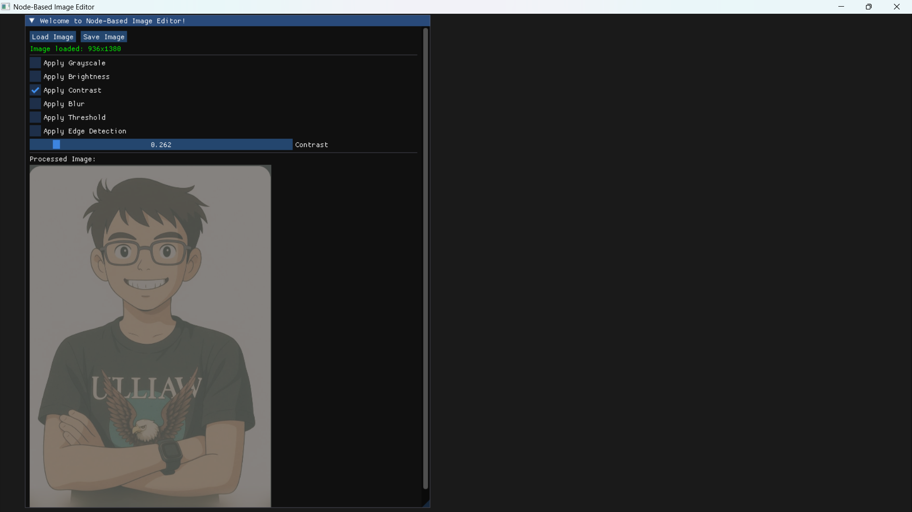

---

### 5. Apply Blur

Applies a **Gaussian blur** for smoothing the image.

📦 Uses `cv::GaussianBlur()` with fixed kernel size.

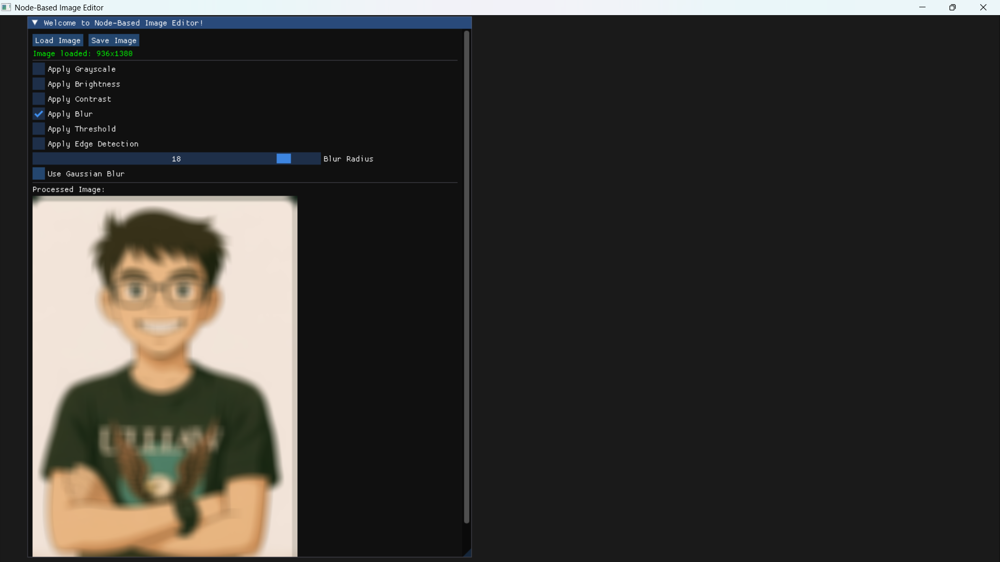

---

### 6. Apply Threshold

Binarizes the image using a fixed threshold. All pixel intensities above the threshold are set to white; others to black.

📦 `cv::threshold()` used with a default value.

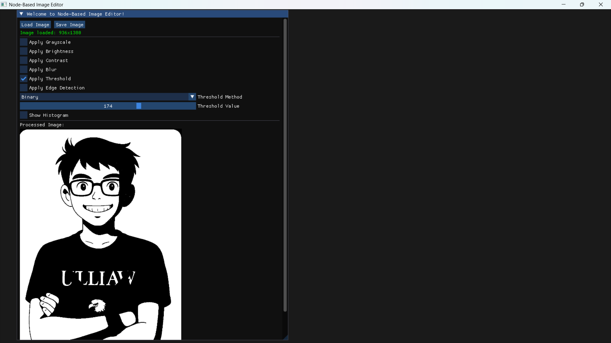

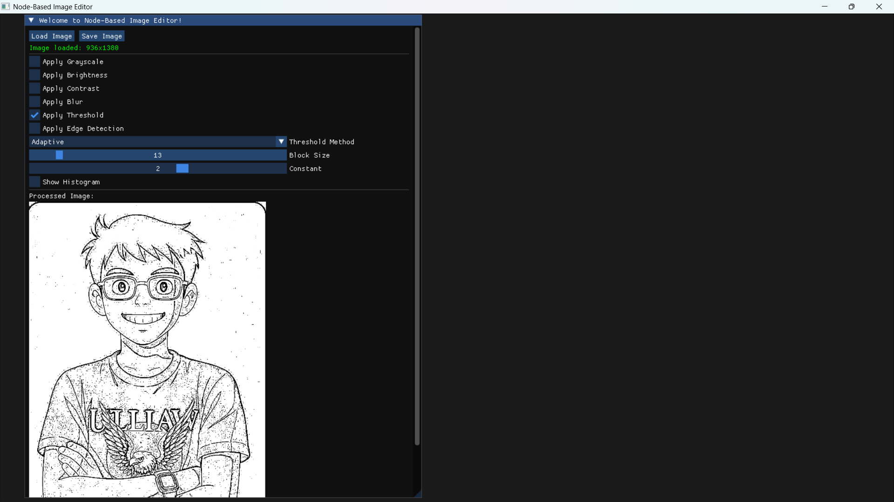

---

### 7. Apply Edge Detection

Performs **Canny Edge Detection** on the grayscale image.

📦 Uses `cv::Canny()` internally.

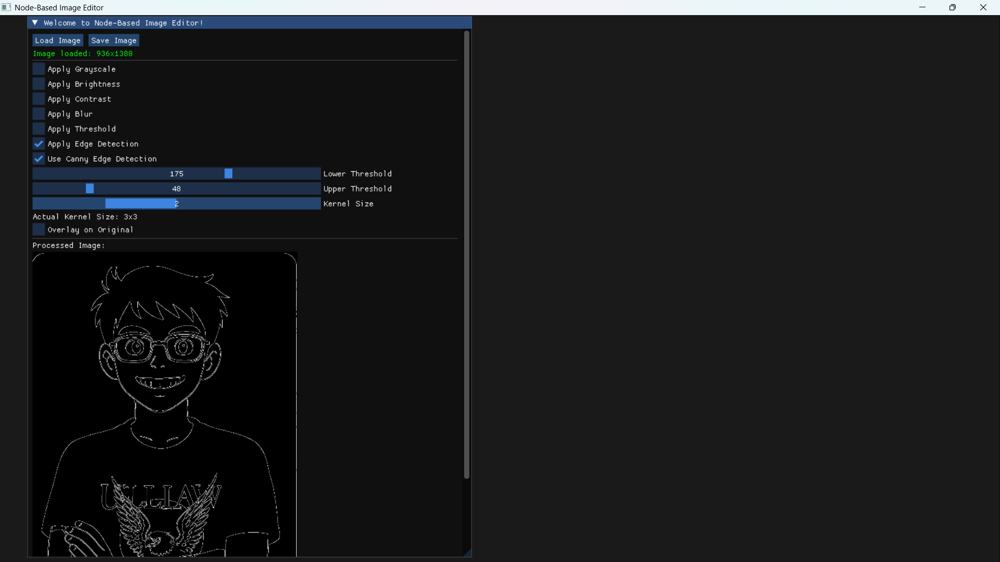

---


### 8. Using Multiple Features

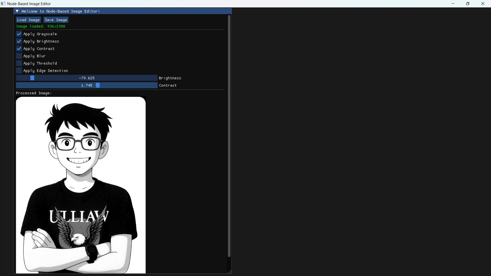

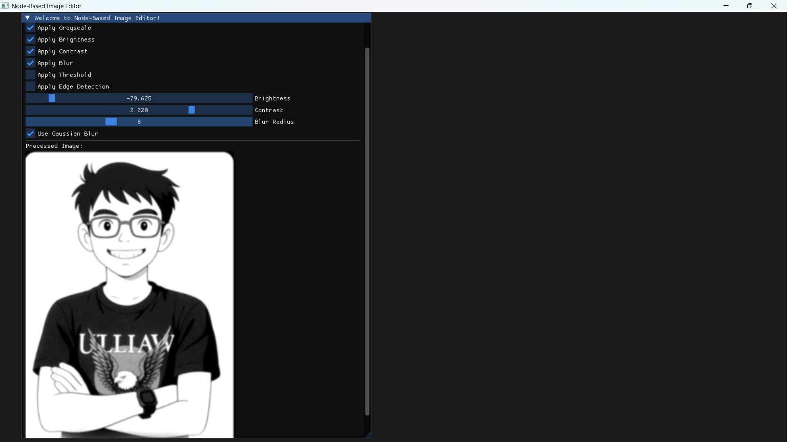


### 9. Saving the processed image

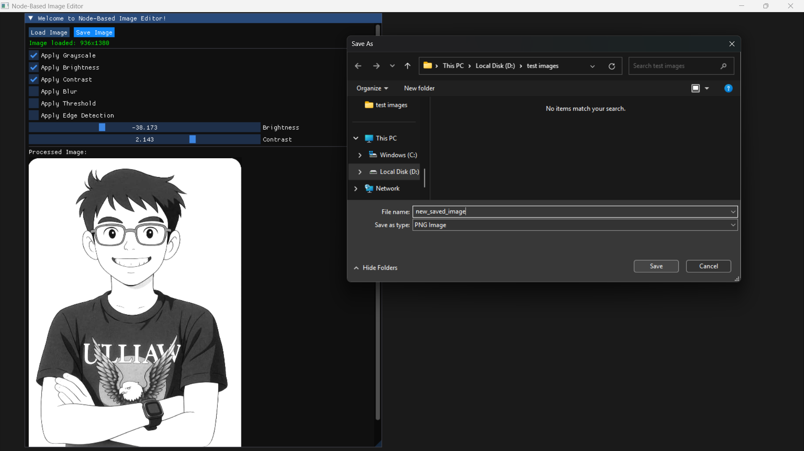


---

## 🔧 How to Build

Make sure you have **CMake** and **OpenCV** installed.

```bash
git clone https://github.com/Vaibhav-Chitransh/node-based-image-processor.git
cd node-based-image-processor
mkdir build && cd build
cmake ..
nmake
node-based-image-processor.exe
```

